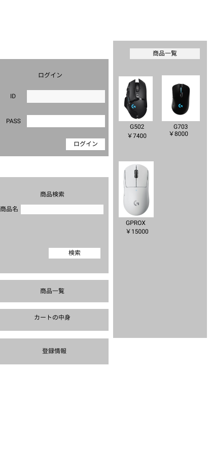

### 画面詳細図
## トップページ
### プロトタイプは以下のリンク先
[プロトタイプ](https://www.figma.com/file/ojVkeDEgQYpl76AloUyQpg/Untitled?node-id=0%3A1)
*****

*****
| ID | 要素 | 内容 | アクション | イベント | 対応DB |
|----|-----|------|-----------|----------|-------|
|1   |バナー|サイト名表示|-    |-          |-     |
|2   |ログイン|テキスト画像|-    |-        |-       | 
|3   |ID|入力欄|テキスト入力|-    |○    |
|4   |PASS|入力欄|テキスト入力|-   |○    |
|5   |ログインボタン|ボタン|クリック|ログイン処理実行|    |
|6   |商品検索|テキスト画像|-   |-    |-    |
|7   |商品名|テキスト表示|-   |-    |-    |
|8   |商品名|入力欄|テキスト入力|-    |○   |
|9  |検索|ボタン|クリック|検索処理実行|○    |
|10  |商品一覧|画像ボタン|クリック|商品一覧へ遷移|○   |
|11  |カートの中|画像ボタン|クリック|カートの中へ遷移|○   |
|12  |登録情報|画像ボタン|クリック|登録情報へ遷移|○   |
|13  |商品一覧|テキスト表示|-    |-    |○    |
|14  |商品画像|画像リンク|クリック|商品詳細へ遷移|○   |
|15  |商品名|テキストリンク|クリック|商品へ遷移|○   |
|16  |価格|テキスト表示|-    |-    |○    |
